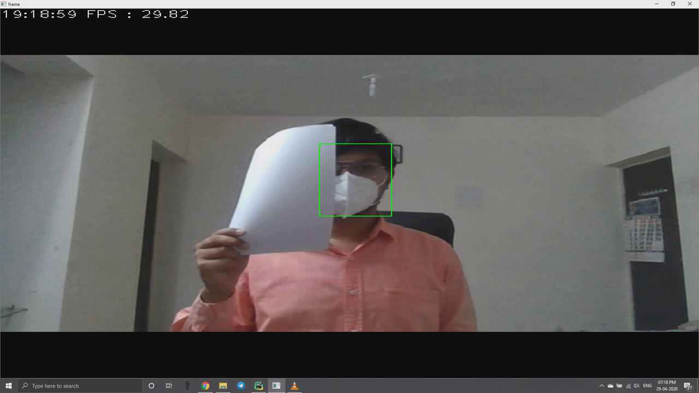
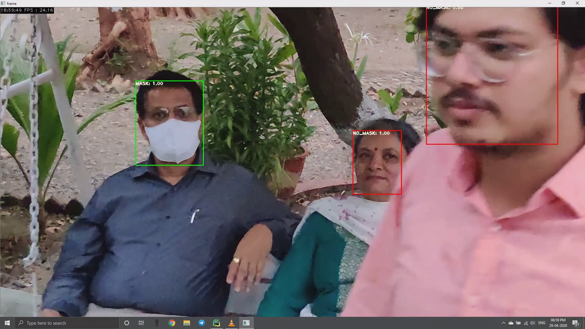
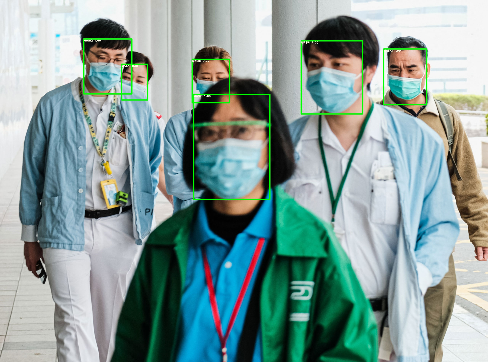
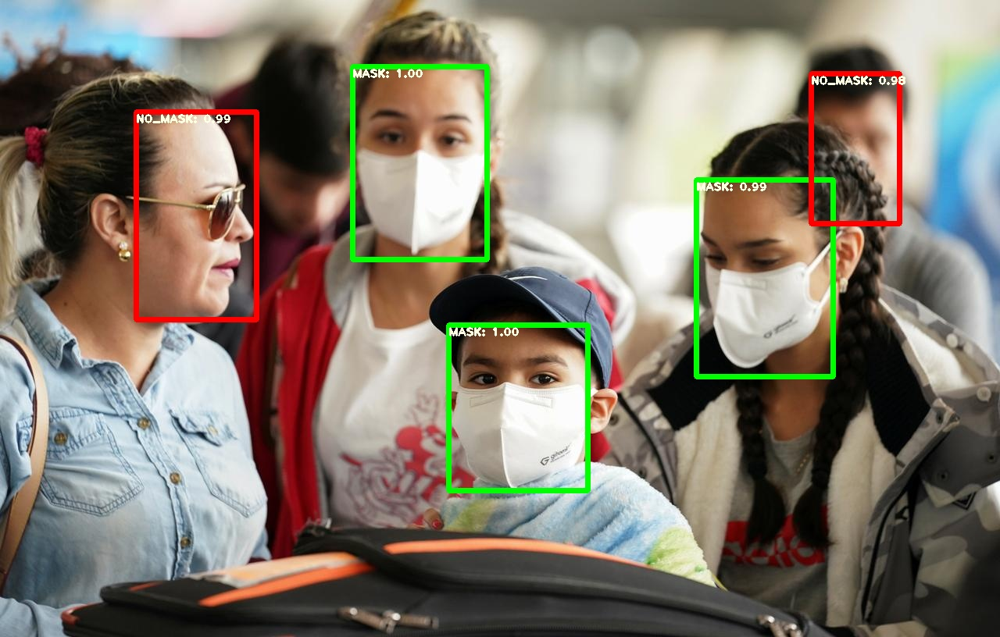

# FACE-MASK DTECTION
A minimal PyTorch implementation of YOLOv3, with support for training, interface & evalution.<br>
To train on custom dataset please visit my another [[GitRepo]]().

## Installation
##### Clone and install requirements
    > git clone https://github.com/NisargPethani/Face-Mask-Detection-using-YOLO-v3.git
    > cd Face-Mask-Detection-using-YOLO-v3/
    > pip install -r requirements.txt

##### Download Checkpoint
Download checkpoint From [[GoogleDrive]]() <br>
Copy `yolov3_ckpt_35.pth` into `checkpoints/`

## Evalution
Evaluates the model.

    > python validate.py --weights_path checkpoints/yolov3_ckpt_35.pth

Average Precisions:
| Class                   | AP 				  |
| ----------------------- |:-----------------:|
| Class '0' (MASK)        | 73.0              |
| Class '1' (NO_MASK)     | 83.3              |

mAP: 78.19

## Real Time Detection
    > python cam_detect.py
Some Screen-shots of Real-Time Detection is shown below 

<p align="center"></p>
<p align="center"></p>

## Detection in Image
Move inmages to `testing/input/images`

    > python image_detect.py --image_folder testing/input/images

<p align="center"></p>
<p align="center"></p>

## Detection in Video
Make new directory with name: `'videos'` in `testing/input`<br>
Move videos to `testing/input/videos`

    > python video_detect.py --image_folder testing/input/videos


## Credit
[[Paper]](https://pjreddie.com/media/files/papers/YOLOv3.pdf) [[Project Webpage]](https://pjreddie.com/darknet/yolo/) [[Authors' Implementation]](https://github.com/pjreddie/darknet)

```
@article{yolov3,
  title={YOLOv3: An Incremental Improvement},
  author={Redmon, Joseph and Farhadi, Ali},
  journal = {arXiv},
  year={2018}
}
```

Also Help is taken from [[GitRepo]](https://github.com/eriklindernoren/PyTorch-YOLOv3.git)